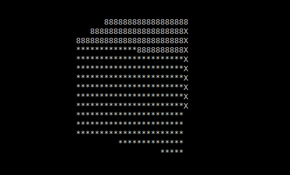

###### Практична робота №2
## Рендеринг зображення методом трасування променів

_**Примітка**. Як ви могли б вже запідозрити, ця робота дуже схожа на практичну роботу №5 з першого курсу. Фактично, це вона і є, але в розширеному вигляді та з додатковими акцентами. Якщо ви виконували цей варіант два роки тому, то ви можете використати власні напрацювання, але не забувайте, що важливим аспектом поточного курсу є архітектура, і вам будет потрібно цю програму покращувати та розвивати до кінця семестру_

### Мета роботи
1) Розібратися (або освіжити в пам'яті) загальний принцип рендерингу зображення методом трасування променів;
2) Так самом згадати\вивчити структуру даних "дерево" та її користь у обробці просторових даних;
3) На практиці познайомитись із використанням Dependency Injection у проекті, що розвивається;
4) Використавши напрацювання з попередньої роботи попрактикуватись у розробці модульних програм, до яких змінюються вимоги у процесі їх розвитку.

### Що треба зробити
#### Загальний опис
Спректувати та написати програму, що приймає на вхід файл формату wavefront obj (парсити його можна за допомогою готової бібліотеки), а на виході створює зображення певного формату (того що ви реалізували в попередній роботі) з візуалізацією моделі, яка знаходиться у вхідному файлі. Аргументи програми:

- `--source` - вхідний obj файл для рендерингу;
- `--output` - шлях до зображення-результату;

Приклад виклику програми:
```
> Renderer.exe --source=cow.obj --output=rendered.png
```


#### Опис методу трасування променів
Метод трасування променів полягає в наступному:
Кожна точка або вектор задається трьома координатами. Зазвичай, вектори використовуються замість точок у просторі як вектор між початком координат і точкою (координати вектора будуть тоді збігатися з координатами точки), тобто точка і вектор — одне й те ж поняттяю. Геометрія, яку треба візуалізувати, задається у вигляді набору трикутників у 3d просторі. Кожен трикутник — це набір з трьох точок/векторів у просторі. Камера, що "знімає" сцену, задається точкою в просторі та вектором напряму зйомки. Камера абсолютно уявна, це лише спосіб зручно називати точку, з якої братимуть початок промені під час трасування. Перед нею на невеликій відстані розташований уявний екран, що розділений на пікселі, кожен з якиї відповідає пікселю у вихідному зображенні. Пікселі на екрані — це також лише точки в просторі, екраном він названий лише для зручності. Із камери в бік сцени запускаються промені, кожен з яких проходить через піксель на уявному екрані. Для кожного з цих променів програма обчислює, чи перетинає він будь-який з трикутників, що розташовані на сцені. Якщо таких трикутників немає, то піксель фарбується в колір фону (чорний, наприклад). В інакшому випадку піксель фарбується іншим кольором. В найпростішому випадку — будь-яким відмінним від кольору фону. При цьому можуть враховуватися колір об\'єкта, кут падіння променя, затінення, глобальне освітлення і т.д. Для цієї роботи достатньо використати [flat shading](https://en.wikipedia.org/wiki/Shading#Flat_shading).


*Зображення взяті з сайту www.scratchapixel.com*

Оскільки кількість трикутників може бути значною (зазвичай набагато більше за 1 млн), а швидкість найпростішого алгоритму складає O(n*m), де n — кількість трикутників, а m — кількість пікселів зображення, використовують структури даних схожі на дерева, що дозволяють швидко відсікати трикутники, які точно не перетинаються з променем під час трасування.

В цій роботі ви *маєте* використати структуру [octree](https://en.wikipedia.org/wiki/Octree#:~:text=An%20octree%20is%20a%20tree,three%2Ddimensional%20analog%20of%20quadtrees.) (або [KD-tree](https://en.wikipedia.org/wiki/K-d_tree) чи [R-tree](https://en.wikipedia.org/wiki/R-tree), що складніше) для оптимізації швидкості роботи трасування, інакше зображення буде генеруватися хвилин 5 і більше. Почніть із простого варіанту і переходьте до складнішого, коли все працюватиме. Наприклад: спочатку на сцені можна показувати лише кулю, перетин променя з якою дуже легко обчислити. Якщо промінь перетинається з кулею, фарбуйте піксель у червоний, якщо ні — в білий. На виході має вийти прапор Японії. Зверніть увагу на пропорції, щоб на цьому кроці не вийшов еліпс. Далі можна спробувати додати один трикутник і алгоритм Моллера-Трумбора, який є на [вікі](https://en.wikipedia.org/wiki/M%C3%B6ller%E2%80%93Trumbore_intersection_algorithm) разом із кодом. Лише після цього варто завантажувати obj-файли. І лише насамкінець слід залишити дерево, коли стане зрозуміло, що програма працює і без нього, але дуже довго.

#### Приклад
Оскільки трасування променів доволі незрозуміла для багатьох тема, за [цим посиланням](https://repl.it/@L4fter/SpottedEnragedShell) ви можете знайти реалізацію саме трасування, результат якої виводиться в консоль.

Додавши затінення flat shading, освітлення та рух камери можна створити програму, що виводить в консоль зображення



#### Матричні перетворення
В цій роботі ви працюєте фактично із простою сценою, що складається з трьох об'єктів:
1. Камера. Припускаємо, що камера статична, знаходиться в точці (0, 0, 0) та направлена вздовж осі Z;
2. Власне об'єкт, що рендериться. Ваша програма має підтримувати при завантаженні задавання довільної позиції об'єкта, повороту та масштабу. В цій роботі вам **не** потрібно якимось чином зчитувати ці значення від користувача чи конфігураційного файлу, їх можна задати прямо в коді;
3. Джерело освітлення. Так само як і об'єкт, може знаходитись в довільній точці простору з довільним поворотом;

Для реалізації поворотів\переміщень об'єкту вам знадобиться [вся та математика з матрицями](https://en.wikipedia.org/wiki/Transformation_matrix), про яку ви слухали на лекціях.

#### Інверсія залежностей та ін'єкції
З архітектурної точки зору, ви маєте розділити свою програму на функціональні модулі, які відповідають за різні задачі, виділити з них абстракції та спроектувати програму, що буде відповідати обом частинам [Dependency Inversion Principle](https://en.wikipedia.org/wiki/Dependency_inversion_principle): всі модулі мають посилатись на абстракції, а не на конкретні реалізації, і самі ці абстракції мають бути корректно виділені. Для того щоб досягти можливості легкої підміни конкретних реалізацій, не ламаючи при цьому основної програми потрібно використати якийсь з наявних у обраній мові програмування DI-фреймворків, або написати власний.

Розглянемо приклад абстракцій які можна виділити під час створення програми (я буду використовувати нотацію C++/C# з префіксом I- перед інтерфейсами):
1. ``ICameraPositionProvider`` - надає координати камери в сцені. Маємо просту реалізацію ``StaticCameraPositionProvider``, що просто повертає фіксоване значення (0, 0, 0), яку потім у подальших роботах замінимо на таку, що зчитує необхідні дані з файлу\конфігу;
2. ``IRaysProvider`` - надає список променів, які слід використовувати для прорахунку перетинів з моделлю. Реалізація може бути перспективною камерою, де промені розходяться від фокусної точки або ортогональною камерою, де промені паралельні;
...і так далі


### Оцінювання:
Максимально за роботу можна отримати 12 балів
- Загальная якість написання коду - 3 бали;
- Реалізований алгоритм трасування - 3 бали;
- Реалізація octree: 3 бали, KD-tree: 4 балів
- Використання DI та коректне проектування абстракцій - 2 бали (+2 додаткових бали за самостійне написання DI-контейнера)
